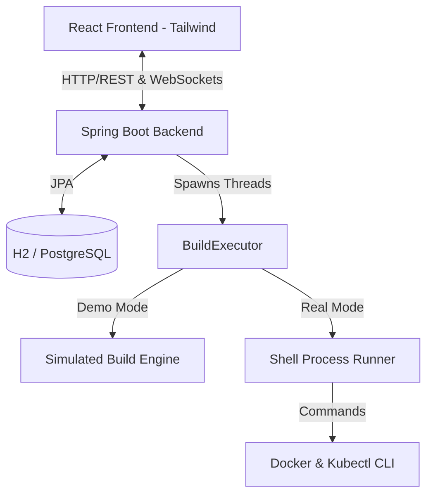

# Antigravity CI/CD Deployment Platform 

Antigravity is a cloud-native, micro CI/CD engine designed to automatically build, test, containerize, and deploy code repositories. Built as a mini version of Jenkins and GitHub Actions, it offers developers a visual dashboard to connect repositories, trigger pipelines, view ANSI-colorized build logs live via WebSockets, and monitor system resource health along with Kubernetes pod structures.

---

## 🚀 Architecture Diagram



---

## 🛠️ Technology Stack

### Backend
- **Core Platform**: Java 21 / Spring Boot 3.3.x
- **Security & Authorization**: Spring Security, JWT (JSON Web Tokens), BCrypt Password Encoder
- **Database Persistence**: Spring Data JPA / H2 (Local Development) / PostgreSQL (Production)
- **Live Communication**: Spring WebSockets (Text handlers, log streaming, and history replays)
- **Performance Diagnostics**: Spring Boot Actuator & Micrometer

### Frontend
- **Framework**: React / Vite SPA
- **Styling Layouts**: Tailwind CSS v4 (CSS-first configuration)
- **Data Visualization**: Recharts (dynamic systems health graphs)
- **UI Components**: Lucide React Icons & Glassmorphism panels

### DevOps & Cloud Infrastructure
- **Containerization**: Multi-stage Dockerfiles (JDK Builder & Alpine JRE Runner)
- **Orchestration**: Kubernetes Deployments, Services, and Ingress manifests
- **Package Management**: Helm charts
- **Automation Servers**: Declarative Jenkins Pipeline (`Jenkinsfile`) & GitHub Actions workflows
- **Reverse Proxy**: NGINX routing
- **Monitoring Analytics**: Prometheus scraper & Grafana dashboard templates

---

## 🌟 Key Features

1. **User Authentication & Auth Filtering**: Stateless signup/login flows utilizing BCrypt and JWT security tokens.
2. **Project Workspace Configs**: Register projects pointing to GitHub endpoints, target Docker tags, target AWS registries, and Kubernetes namespaces.
3. **Live Log Console (WebSockets)**: Streams pipeline outputs directly to a developer console with full ANSI color support, log file archiving, and history replay upon refreshing the page.
4. **Varying Build Orchestration (Strategy Pattern)**:
   - `SimulatedBuildExecutor` (Default): Sequences realistic step logs (Clone, Maven Test, Jar compiling, Docker tag building, AWS registry pushing, Kubernetes rollout status checks).
   - `RealBuildExecutor`: Runs actual OS commands (`git`, `mvn`, `docker`, `kubectl`) using `ProcessBuilder` if CLI tools are available.
5. **Interactive Demo Branches**:
   - Branch: `main` — Triggers a successful simulation.
   - Branch: `fail` — Triggers a simulated Maven unit test failure, validating pipeline error propagation.
   - Branch: `real` — Triggers the real shell execution sub-processes.
6. **Cluster Metrics Graphing**: A live monitoring dashboard that polls system usage, rendering rolling charts of CPU, RAM, and Network RX/TX, alongside active Kubernetes pod details.

---

## 📂 Project Structure

```text
├── backend/
│   ├── .mvn/wrapper/                  # Maven wrapper configurations
│   ├── pom.xml                        # Spring Boot configurations and dependencies
│   ├── src/main/java/com/cicd/platform/
│   │   ├── PlatformApplication.java   # Application entrypoint
│   │   ├── config/                    # Security, CORS, JWT, and WebSocket configurations
│   │   ├── controller/                # REST Controllers (Auth, Projects, Builds, Metrics)
│   │   ├── model/                     # Database Entities (User, Project, BuildRun, BuildStep)
│   │   ├── repository/                # JPA interfaces (User, Project, BuildRun, BuildStep)
│   │   └── service/                   # Core business logic services
│   └── src/main/resources/
│       ├── application.properties     # Default H2 developer config
│       └── application-prod.properties# Production-ready PostgreSQL config
├── frontend/
│   ├── src/
│   │   ├── components/                # Custom React widgets (Terminal logs)
│   │   ├── pages/                     # SPA views (Login, Register, Dashboard, Details, Metrics)
│   │   ├── services/                  # Backend API axios callers
│   │   ├── App.jsx                    # SPA routing engine & core layout
│   │   ├── index.css                  # Tailwind v4 configuration & base styles
│   │   └── main.jsx                   # React mounting script
│   ├── package.json                   # Vite dependencies configuration
│   └── postcss.config.js              # Tailwind v4 PostCSS compilation setup
└── devops/                            # DevOps deployment suite
    ├── docker/                        # Multi-stage production Dockerfiles
    ├── k8s/                           # Deployments, Services, and Ingress manifests
    ├── helm/                          # Helm chart packages
    ├── jenkins/                       # Declarative Jenkinsfile pipeline
    ├── github/workflows/              # GitHub Actions workflows
    ├── nginx/                         # Nginx proxy config
    └── monitoring/                    # Prometheus and Grafana dashboards configs
```

---

## 🚦 How to Run Locally

### 1. Launch the Spring Boot Backend
Open a terminal, navigate to the `backend` folder, and execute:
```bash
cd backend
.\mvnw.cmd spring-boot:run
```
- The backend will start on port `8080` (API endpoint: `http://localhost:8080/api`).
- The H2 Database console is available at `http://localhost:8080/h2-console` (JDBC URL: `jdbc:h2:file:./data/cicddb`, Username: `sa`, Password: `password`).
- The WebSocket logs server binds to `ws://localhost:8080/ws/logs`.

### 2. Launch the React Frontend
Open a separate terminal, navigate to the `frontend` folder, and execute:
```bash
cd frontend
npm run dev
```
- The Vite developer server will start at `http://localhost:5173`.

---

## 📝 Demo Flow Instructions

1. **Sign Up & Log In**: Access `http://localhost:5173/#register`, create an account, and log in.
2. **Create a Project**: Click **"New Project"**, input project configurations, and set your Git Clone URL (e.g., `https://github.com/spring-projects/spring-petclinic.git`).
   - *Successful Run*: Set branch to `main`.
   - *Failed Run*: Set branch to `fail` (simulates unit test assertions failing).
   - *Real Run*: Set branch to `real` (invokes actual background system CLI processes).
3. **Inspect Running Pipeline**: Click **"Run Pipeline"** on your project list. Click the build run link. You will see a vertical timeline spinner and a live logs console printing colorized ANSI messages. If you refresh the browser page, logs will auto-replay from the beginning without losing state.
4. **Monitor Infrastructure**: Navigate to **"Cluster Monitor"** in the sidebar to view rolling CPU, Memory, and network traffic charts alongside a pod replica table.
