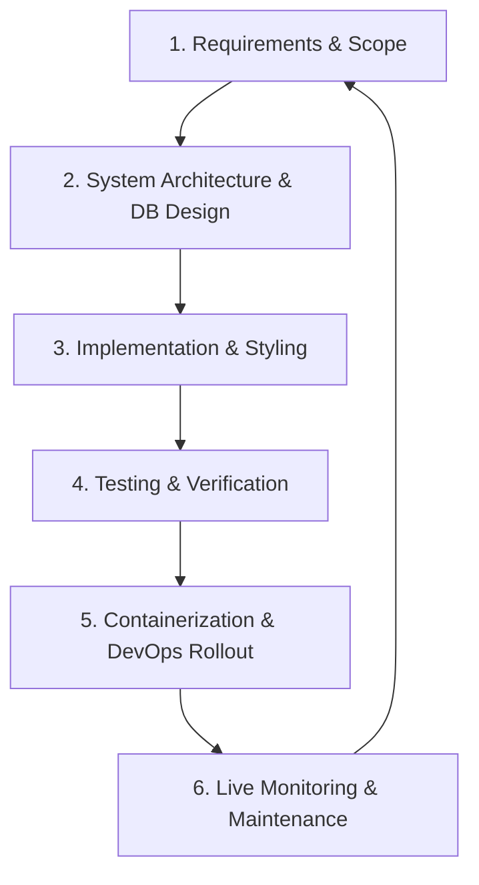

# Software Development Life Cycle (SDLC) - Antigravity CI/CD Platform

This document describes the software engineering practices, lifecycle phases, design patterns, testing strategies, and deployment configurations used in the development of the **Antigravity CI/CD Platform** project.



---

## Phase 1: Requirements Gathering & Analysis

The goal was to construct a self-contained, enterprise-grade, cloud-native CI/CD micro-engine. The system must support the automated cycle of code checkouts, test compilation, container packaging, registry distribution, and cluster orchestration.

### Functional Requirements
- **Secure Authentication**: Users must sign up and authenticate. JWT (JSON Web Tokens) must authorize subsequent REST queries statelessly.
- **Project Configuration**: Users must be able to declare git repository links, access credentials, target image registries, and target namespaces.
- **Database Tracking**: All runs, build step states, durations, and commit information must map to database tables.
- **WebSocket Log Streaming**: System outputs must stream in real-time to active UI views. Existing logs must persist to disk and replay on reconnection.
- **Live Diagnostics**: The UI must display fluctuating CPU, Memory, and Network usage alongside Kubernetes cluster pods configurations.
- **Dual Engine Strategy**: The platform must support both mock logs simulations (for zero-dependency local testing) and real process builders (for real-world environments).

### Non-Functional Requirements
- **Performance**: Static pages and live log console rendering must maintain high responsiveness.
- **Reliability**: Failures in build steps must gracefully abort succeeding stages, transitioning the build state to `FAILED`.
- **Aesthetics**: The UI must follow dark theme variables, responsive grids, sleek progress bars, and glowing status notifications.

---

## Phase 2: Design & System Architecture

The platform follows a decoupled, three-tier architecture:

```text
+------------------------+      HTTP/REST &      +------------------------+
|      React SPA         | <===================> |   Spring Boot Engine   |
| (Tailwind v4 / Rechart)|      WebSockets       |  (JJWT / WebSockets)   |
+------------------------+                       +------------------------+
                                                             ||
                                                             || JPA / Hibernate
                                                             \/
                                                 +------------------------+
                                                 |    H2 / PostgreSQL     |
                                                 +------------------------+
```

### Database Entity Relationship Model (ERM)
- **User (users)**: Tracks credentials (hashed password, unique username, and email). One-to-Many relationship with `Project`.
- **Project (projects)**: Holds repository URLs, branches, registries, namespaces, and timestamps. One-to-Many relationship with `BuildRun`.
- **BuildRun (build_runs)**: Represents an individual run triggered by git events or manual clicks. Tracks status, duration, and commit details. One-to-Many relationship with `BuildStep`.
- **BuildStep (build_steps)**: Log nodes corresponding to pipeline stages (CLONE, TEST, BUILD, DOCKER_BUILD, DOCKER_PUSH, K8S_DEPLOY).

### Log Streaming & Replay Design
To handle log streaming without losing content, we combined file writing with active WebSocket sessions:
1. **File System Archiving**: When a build commences, log outputs write to `logs/builds/build_{buildId}.log`.
2. **Dynamic Broadcasting**: In parallel, `LogStreamHandler` loops over connected WebSocket sessions matched to `buildId` and sends log text packages.
3. **Replay Strategy**: When a user connects to a build console, the system opens the corresponding log file on disk and pushes all historical log lines to that session first, ensuring a seamless user experience upon tab refreshes.

---

## Phase 3: Implementation & Development

### Backend Package Division (Spring Boot)
- **`config`**: Configures CORS, registers HTTP route patterns, validates JWT auth headers, and sets up WebSocket endpoints.
- **`model`**: Standard JPA classes containing Hibernate annotations for automatic table generation.
- **`repository`**: Database CRUD interfaces mapping to SQL queries.
- **`controller`**: Exposes REST interfaces (`/api/auth`, `/api/projects`, `/api/builds`, `/api/monitoring`).
- **`service`**: Includes authentication logic, resource metric polling, and execution strategy handlers (`SimulatedBuildExecutor` and `RealBuildExecutor`).

### Frontend Design (React + Tailwind v4)
- **State-Based Hash Routing**: Avoids dependency version mismatches. Tracks `window.location.hash` and parses path variables dynamically.
- **Tailwind CSS v4 Configuration**: Configures custom colors (like `dark-bg`, `dark-card`), monospace font stacks, and glowing shadows directly in `index.css` using the `@theme` directive.
- **High-Fidelity Terminal Widget**: Decodes ANSI colors (e.g. `\u001B[1;32m` for success checkmarks) to colored HTML elements. Supports auto-scrolling, clipboard copies, and text search filtering.

---

## Phase 4: Testing & Verification

### Automated Verifications
- Compilations are verified using Maven Wrapper (`.\mvnw.cmd package -DskipTests`).
- Frontend compilations are verified using Vite bundlers (`npm run build`).

### Interactive Verification (Demo Configurations)
To easily demo and test all platform behaviors locally, the build orchestrator checks the target branch name:
- **`main`**: Simulates a successful CI/CD run, changing step states to `SUCCESS` and logging outputs sequentially.
- **`fail`**: Simulates a unit test assertion failure during the `TEST` stage. The build state transitions to `FAILED`, and subsequent steps (BUILD, DOCKER_BUILD, etc.) transition to `SKIPPED`.
- **`real`**: Invokes real system shell commands via Java's `ProcessBuilder` (requires local git/maven/docker installations).

---

## Phase 5: Deployment & DevOps Strategy

We have packaged and prepared templates for standard deployment tools:
- **Dockerization**: Uses multi-stage builds. The frontend builder packages assets, which are then copied to a lightweight Nginx image. The backend builder compiles the source and copies the jar file to a hardened Alpine JRE runtime environment.
- **Kubernetes Orchestration**: Outlines Pod Deployments, Service types (ClusterIP for backend API, NodePort for frontend static files), and Ingress route configurations matching public endpoints (`cicd-platform.local`).
- **Helm Package Management**: Parameterizes replica limits, database hostnames, credentials secrets, and image resource boundaries.
- **Pipeline Automation**: Demonstrates how this platform can be deployed through declarative `Jenkinsfile` scripts or GitHub Actions workflows (authenticating, pushing to AWS ECR registries, and upgrading EKS clusters via Helm).

---

## Phase 6: Monitoring & Maintenance

Continuous operation and maintenance are handled through system diagnostic APIs:
- **Spring Actuator & Prometheus Scrapers**: The application exposes micro-diagnostic values at `/actuator/prometheus`. A configured Prometheus server scrapes these values every 5 seconds.
- **Grafana Visualization**: We provided an importable JSON dashboard config (`grafana-dashboard.json`) to plot JVM memory curves, CPU allocations, GC counts, and HTTP throughput indicators.
- **Live UI Diagnostic Charts**: The UI regularly polls `/api/monitoring/metrics` every 1.5 seconds, accumulating a rolling buffer of 15 entries to display system resource curves in the frontend dashboard.
